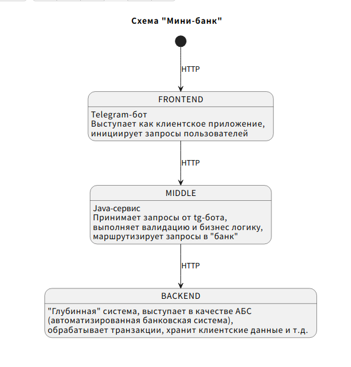

## Практический проект "Мини-банк" в рамках Backend-академии GPB IT Factory
### Студент Хабибуллин И.Ф.

<details>
    <summary><b>Краткое описание проекта Мини-банк</b></summary>  

В рамках практики мы разработаем "Мини-банк", который будет состоять из трёх компонентов:
1. `frontend` (telegram-bot на java/kotlin);
2. `middle-слой` (java/kotlin-сервис);
3. `backend` (java/kotlin-сервис). 

   - ниже представлена схема

    <details>
        <summary><b>Схема в виде PlantUML </b></summary>
   
            @startuml
                title Схема "Мини-банк"

                [*] --> FRONTEND : HTTP
           
                FRONTEND : Telegram-бот
                FRONTEND : Выступает как клиентское приложение,
                FRONTEND : инициирует запросы пользователей
                FRONTEND --> MIDDLE : HTTP
           
                MIDDLE : Java-сервис
                MIDDLE : Принимает запросы от tg-бота,
                MIDDLE : выполняет валидацию и бизнес логику,
                MIDDLE : маршрутизирует запросы в "банк"
                MIDDLE --> BACKEND : HTTP

                BACKEND : "Глубинная" система, выступает в качестве АБС
                BACKEND : (автоматизированная банковская система),
                BACKEND : обрабатывает транзакции, хранит клиентские данные и т.д.
            @endtuml

    </details>

    <details>
        <summary><b>Схема в виде рисунка</b></summary>  
    
    
    </details>

</details>


<details>
    <summary><b>Как запустить проект?</b></summary>

1. Запуск бота в телеграме требует наличия токена и имени.
2. Имя и токен получаются у офицального бота в Telegram ссылка: [@BotFather](https://t.me/BotFather)
3. Пример имени: ```AdminForDusBot```
4. Пример токена: ```659600****:AAE5mrg6tuLtbooygqou9zooLN_74q****```
5. Скачать проект по ссылке с ```github.com``` в виде zip архива и разахивировать папку ```khabibullin-frontend-bot```  
6. Или склонировать проект командой в терминале/командной строке
```bash
git clone git@github.com:gpb-it-factory/khabibullin-telergam-bot.git
```
7. Перейти в папку ```khabibullin-frontend-bot```
8. В папке набрать команду в терминале/командной строке
```bash
./gradlew clean && ./gradlew assemble
```
9. После этого набрать команду в терминале/командной строке команду из блока кода ниже,  подставив вместо ```<YOUR_BOT_NAME>``` имя бота,
а вместо ```<YOUR_BOT_TOKEN>``` ваш токен бота
```bash
java -jar khabibullin-frontend-bot-0.5.jar --bot.name=<YOUR_BOT_NAME> --bot.token=<YOUR_BOT_TOKEN>
```
10. Пример команды для запуска:
```bash
java -jar build/libs/khabibullin-frontend-bot-0.5.jar --bot.name=AdminForDusBot --bot.token=659600****:AAE5mrg****tbooygqou9zooLN_74q6wwAc
```


</details>

<details>
    <summary><b>Технологический стэк</b></summary>  


1. Языки: [Java 17](https://www.java.com/ru/)+ в виде реализации [Axiom JDK](https://axiomjdk.ru/pages/downloads/#/java-17-lts)
2. Система сборки: [Gradle 8.7](https://gradle.org/)
3. Базовый фреймворк: [Spring Boot](https://spring.io/projects/spring-boot)
4. Дополнительные библиотекам: [JUnit 5](https://junit.org/junit5/), [Testcontainers](https://testcontainers.com/), [AssertJ](https://assertj.github.io/doc/), [Logback](https://logback.qos.ch/), [Micrometer](https://micrometer.io/), [MapStruct](https://mapstruct.org/)
</details>